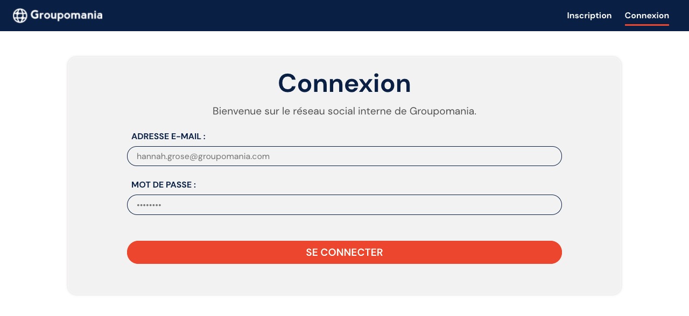

# Projet 7 : Créer un réseau social d’entreprise



## Backend

Ouvrez le répertoire [backend](backend) et créez un fichier .env en vous basant sur le modèle [.env.sample](backend/.env.sample). Modifiez les informations requises.

Depuis ce même répertoire, exécutez les commandes `npm install` et `npm start`.

## Base de données

Créez une base de données intitulée **groupomania** puis importez le fichier [groupomania_database.sql](backend/groupomania_database.sql) afin de créer les tables nécessaires au fonctionnement de l'application :

```
mysql -u [votre identifiant] -p groupomania < [chemin menant à groupomania_database.sql]
```

Pour donner les droits d'administrateur à un utilisateur :

```
UPDATE Users SET admin = 1 WHERE user_id = [identifiant de l'utilisateur];
```

## Frontend

Ouvrez le répertoire [frontend](frontend) et créez un fichier .env en vous basant sur le modèle [.env.sample](frontend/.env.sample). Modifiez les informations requises.

Depuis ce même répertoire, exécutez les commandes `npm install` et `npm run serve`.
